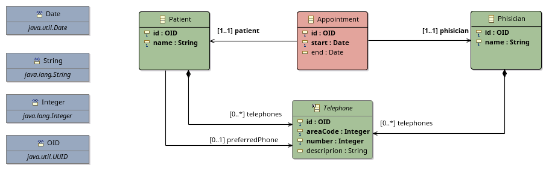

# IBM1050 - Sistemas Distribuídos - 1º sem. 2017 - Implementação de um serviço RESTful

 Um exercício sobre serviços web RESTful para alunos da disciplina IBM1050 - Sistemas Distribuídos (2017). Este projeto foi dado como exercício de aula durante um estágio do Programa de Aperfeiçoamento do Ensino - USP. O histórico de commits apresenta as diferentes fases de execução do trabalho. (Apenas parte dos *endpoints* RESTful foram implementados. Os demais ficam como exercício ao aluno.)

## Objetivo

Definir, implementar e utilizar um serviço RESTful simples, provendo uma API para a manipulação de recursos que representam pacientes, médicos e consultas agendadas de uma clínica.

## Modelagem do serviço RESTful

### 1. Modelagem conceitual da aplicação

Inicialmente, modelamos conceitualmente os dados manipulados pela aplicação.
Este modelo conceitual pode ser representado pelo modelo entidade-relacionamento do banco de dados, um conjunto de classes que encapsulam os dados da aplicação ou um modelo mais abstrato, como um diagrama de classes UML.
Um modelo conceitual simples para os dados da nossa clínica é apresentado abaixo:



- **Patient**: Representa um paciente da clínica. Um paciente possui um nome (atributo `name`) e uma lista (possivelmente vazia) de números de telefone associados (referência `telephones`).
  Um número de telefone dessa lista pode ser especificado como o número de preferência para o contato com o paciente (referência `preferredPhone`).
  Por fim, todo paciente possui um identificador global único (atributo `oid`);
- **Telephone**:
  Representa um número de telefone. Um número de telefone possui um código de área (atributo `areaCode`) e um número local (atributo `number`).
  Uma descrição textual pode ser acrescida a um dado número de telefone (atributo `description`).
  Por fim, um número de telefone também possui um identificador global único (atributo `oid`);
- **Phisician**:
  Representa um dos médicos da clínica. Um médico possui um nome (atributo `name`) e uma lista (possivelmente vazia) de números de telefone associados (referência `telephones`).
  Por fim, todo médico também possui um identificador global único (atributo `oid`);
- **Appointment**:
  Representa o agendamento de uma consulta de um paciente com um médico.
  Uma consulta referencia obrigatoriamente o paciente e o médico associados (referências `patient` e `phisician`, respectivamente).
  Uma consulta possui um momento de início (atributo `start`) e um momento de término (atributo `end`).
  Por fim, toda consulta também possui um identificador global único (atributo `oid`).

Uma descrição dos tipos primitivos dos dados manipulados pela aplicação também é apresentado no diagrama.
Essa descrição é útil durante a implementação da comunicação do serviço com a solução de armazenamento utilizada camada de persistência, bem como para a definição da representação dos recursos providos que será compartilhada pelo serviço com seus clientes.

### 2. Modelagem das representações de recursos providas pelo serviço

Uma especificação Swagger [@swagger] das representações dos recursos é apresentada abaixo.
Esta especificação é obtida a partir do modelo conceitual da aplicação e devine os tipos de dados compartilhados entre serviço e clientes.
Adicionamos uma representação adicional para a representação do relatório de erros encontrados pelo serviço em uma requisição do cliente.

```yaml
definitions:

  Patient:
    type: object
    properties:
      id:
        type: string
        description: The unique global id of this patient.
      name:
        type: string
        description: The patient's full name.
      telephones:
        type: array
        items:
          $ref: '#/definitions/Telephone'
      preferredPhone:
        type: string
        description: The ID of the preferred phone to call this patient.

  Telephone:
    type: object
    properties:
      id:
        type: string
        description: The unique global id of this telephone number.
      number:
        type: string
        description: The full telephone number.

  Physician:
    type: object
    properties:
      id:
        type: string
        description: The unique global id of this physician.
      name:
        type: string
        description: The physician's full name.

  Appointment:
    type: object
    properties:
      id:
        type: string
        description: The unique global id of this appontment.
      physician:
        $ref: '#/definitions/Physician'
      patient:
        $ref: '#/definitions/Patient'
      date:
        type: string
        format: dateTime

  Error:
    type: object
    properties:
      code:
        type: integer
        format: int32
      message:
        type: string
      fields:
        type: string
```

Além de uma descrição dos objetos compartilhados por uma aplicação, é preciso decidir quais representações serão providas para os recursos que permitem a manipulação desses objetos.
Ao menos uma linguagem de representação adequada deve ser escolhida.
A decisão das linguagem utilizada para representar os recursos providos pelo serviço  impacta diretamente como o cliente deve ser implementado.
Mais de uma linguagem de representação pode ser disponibilizada aos clientes.

As linguagens de representação atualmente mais relevantes no desenvolvimento de serviços RESTful são o *JavaScript Object Notation* (JSON) [@json] e o *eXtensible Mark-up Language* (XML) [@xml].
Dentre as duas, escolheremos prover inicialmente suporte ao JSON.
JSON é o padrão *de facto* para o desenvolvimento de novos serviços RESTful atualmente, dado o suporte ubíquo ao formato por navegadores e muitos frameworks.
Adicionalmente,  JSON é uma linguagem facilmente compreendida por humanos.   
De modo a apresentar que o serviço consome e produz representações JSON de seus recursos, o MIME type adequado (`application/json`) é incluído nas seções `consumes:` e `produces:` do cabeçalho da especificação Swagger do serviço.


### 3. Modelagem dos recursos disponibilizados pelo serviço

Uma vez definidos os tipos de dados compartilhados entre o serviço e seus cliente, bem como a representação desses dados a ser utilizada, inicia-se a modelagem dos recursos disponibilizados pelo serviço.
Nesta etapa, inicialmente são definidos os recursos que serão providos pelo serviço RESTful, bem como subrecursos acessíveis a partir dos recursos principais.
Em seguida, são modelados os identificadores associados a cada recurso, métodos HTTP suportados e possíveis respostas recebidas pelos clientes que os utilizam.

Os seguintes recursos foram identificados para serem compartilhados pelo serviço:

- **Um recurso que represente a coleção de pacientes.** Essa coleção é única e deve permitir a listagem dos pacientes cadastrados, a busca por substring do nome do paciente e a inclusão de um novo paciente.
  Cada paciente é um subrecurso dessa coleção.
- **Um recurso individual para cada paciente, de forma a permitir o acesso aos seus dados.** Este recurso deve permitir a recuperação das informações desse paciente, bem como a atualização dessas informações e a remoção desse paciente. Subrecursos deste recurso são utilizados para acessar as consultas associadas ao paciente e seus números de telefone.
- **Um recurso que represente a coleção de médicos.** Essa coleção é única e deve permitir a listagem dos médicos cadastrados, a busca por substring do nome do médico e a inclusão de um novo médico.
  Cada médico individual é um subrecurso dessa coleção.
- **Um recurso individual para cada médico, de forma a permitir o acesso aos seus dados.** Este recuso é modelado de forma semelhante ao recurso de acesso aos dados de um paciente.
- **Um recurso que represente a coleção de consultas.** Essa coleção é única e deve permitir a listagem de consultas agendadas para um dado período de tempo, bem como a inclusão de uma nova consulta.
- **Um recurso individual para cada consulta, de forma a permitir o acesso aos seus dados.** Este recurso deve permitir a recuperação das informações da consulta, bem como a atualização dessas informações e a remoção desse consulta. Porém, não deve permitir a atualização dos dados do paciente ou do médico associados.

Números de telefone não precisam ser acessáveis como recursos próprios em nossa aplicação.
Neste sentido, números de telefone serão acessados apenas por meio dos recursos que representam pacientes e médicos.

Com base na lista anterior, podemos definir os identificadores que serão associados a cada recurso, bem como os métodos HTTP aceitos por estes recursos.
Definimos também os códigos de status possíveis de serem retornados para cada  requisição de um cliente.

Uma descrição abstrata para os recursos modelados é apresentada abaixo.
A formalização desta descrição em uma especificação Swagger é apresentada na seção `paths:` no arquivo `swagger.yaml` anexo.

#### /patients

Representa a coleção de pacientes. Este recurso deve prover suporte aos métodos `GET` e `POST`.

O método `GET` retorna uma representação da coleção de pacientes.
Um campo opcional da query string (`name`) pode ser usado para limitar a coleção recuperada aos pacientes cujos nomes contenham uma dada substring.
Possíveis códigos de status retornados pelo método `GET` são `200 - OK` e  `404 - Not found`.
`200 - OK` é retornado quando um conjunto de pacientes foi encontrado. Este conjunto de pacientes é retornado ao cliente no corpo da resposta HTTP.
Por fim, `404 - Not found` é retornado se nenhum paciente foi encontrados segundo os critérios de busca da requisição.

O método `POST` permite incluir um novo paciente na coleção.
O método `POST` recebe obrigatoriamente uma representação de um paciente no corpo da requisição HTTP.
Pela definição do HTTP, o método `POST` não deve receber nenhum parâmetro via query string.
Possíveis códigos de status retornados pelo método `POST` são `201 - Created`, `400 - Bad Request` e `409 - Conflict`.
`201 - Created` é retornado quando a requisição do cliente é bem sucedida e um novo recurso paciente é criado na base de dados.
`400 - Bad Request` é retornado quando a requisição do cliente possui algum erro de formato, como um campo não existente ou incorretamente nomeado.
Por fim, `409 - Conflict` é retornado se a requisição do cliente possui uma representação de paciente com um id já existente na coleção.

#### /patients/{id}

Representa o paciente associado ao identificador `{id}`. Este recurso deve prover suporte aos métodos `GET`, `PUT` e `DELETE`;

O método `GET` retorna uma representação do paciente.
Possíveis códigos de status retornados pelo método `GET` são `200 - OK` e  `404 - Not found`.
`200 - OK` é retornado quando o paciente com o identificador passado é encontrado e é retornado no corpo da resposta à requisição do cliente.
Por fim, `404 - Not found` é retornado quando o paciente com o identificador passado não foi encontrado.

O métdo `PUT` atualiza um recurso paciente com a informação contida no corpo da mensagem HTTP.
Possíveis códigos de status retornados pelo método `PUT` são `204 - Updated`, `400 - Bad request` e `404 - Not found`.
`204 - Updated` é retornado quando o paciente com o identificador passado é encontrado e atualizado corretamente com a informação contida no corpo da  requisição do cliente.
`400 - Bad Request` é retornado quando a requisição do cliente possui algum erro de formato, como um campo não existente ou incorretamente nomeado.
Por fim, `404 - Not found` é retornado se não há paciente associado ao identificador passado.

O método `DELETE` remove o paciente referenciado pelo identificador `{id}` da coleção.
O método `DELETE` não deve receber parâmetros na query string nem informação no corpo da requisição.
Possíveis códigos de status retornados pelo método `DELETE` são `200 - OK` e `404 - Not found`.
`204 - No content` é retornado quando o paciente identificado é encontrado e removido da coleção. Nenhum conteúdo adicional é retornado ao cliente no corpo da resposta.
Por fim, `404 - Not found` é retornado quando o paciente identificado não exite previamente na coleção.


#### /patients/{id}/appointments

Representa a lista de consultas associadas a este paciente. Este recurso deve prover suporte ao método `GET`.

#### /phisicians

Representa a coleção de médicos. Este recurso deve prover suporte aos métodos `GET` e `POST`. Um campo opcional da `query string` pode ser usado para a coleção por uma substring do nome dos médicos;

#### /phisicians/{id}

Representa o médico associado ao identificador `{id}`. Este recurso deve prover suporte aos métodos `GET`, `PUT` e `DELETE`;

#### /phisicians/{id}/appointments

Representa a lista de consultas associadas a este médico. Este recurso deve prover suporte ao método `GET`.

#### /appoinments

Representa a coleção de consultas agendadas. Este recurso deve prover suporte aos métodos `GET` e `POST`. Um campo opcional da query string pode ser usado para recuperar  apenas consultas que ocorreram após um  dado momento (campo `fromDate`). Um campo opcional da query string pode ser usado para recuperar  apenas consultas que ocorreram antes de um  dado momento (campo `toDate`);

#### /appoinments/{id}

Representa a consulta associada ao identificador `{id}`. Este recurso deve prover suporte aos métodos `GET`, `PUT` e `DELETE`;


## Implementação do serviço e cliente

Durante a aula, implementaremos apenas os recursos acessados via `/patients` e `/patients/{id}`. A implementação dos demais recursos segundo a especificação dada fica como exercício adicional.

### 1. Obtenção de documentação e código stub (cliente e servidor)

1. Abra a especificação Swagger do serviço em um editor.
   Perceba que outros detalhes são acrescidos no cabeçalho desta especificação.
   Leia este cabeçalho e tente avaliar outros atributos do serviço que não foram descritos neste documento.
2. Abra a especificação Swagger no editor online ([http://editor2.swagger.io/](http://editor2.swagger.io/)).
   Perceba que é possível gerar automaticamente uma documentação para o auxílio ao uso do serviço a partir desta especificação.
   Obtenha diferentes versões dessa documentação clicando em `Generate client > HTML` e `Generate client > HTML2` na barra superior.
3. Ainda na barra superior, clique em `Generate server > Spring` e salve o arquivo produzido.
   Este arquivo provê o código *stub* para a execução do serviço, bem como um conjunto de classes Java que provê um ambiente de execução *standalone* para serviços RESTful.
4. De forma semelhante, clique em `Generate client > Java` e salve o arquivo produzido.
   Este arquivo provê stubs para a construção de clientes do serviço definido.
   O arquivo `DefaultApi.java`, presente do diretório `src/main/java/io/swagger/client/api/`, apresenta os métodos disponíveis pela API para a comunicação com o serviço.
   O arquivo `DefaultApiTest.java`, presente do diretório `src/test/java/io/swagger/client/api/`, apresenta exemplos de como utilizar a API definida.

### 2. Implementação do serviço

O código específico para a manipulação dos recursos modelados deve ser adicionado ao  *stub* servidor nas partes marcadas com `// do some magic!`.
Para isso, os seguintes passos devem ser executados:

1. Adicione o diretório `dao` (anexo),  ao diretório `io/swagger/` da implementação *stub* do serviço, obtida no passo 3 da atividade anterior.
   O pacote `dao` contém a classe `PatientDaoMock`, que simulará uma camada de persistência.
   O método estático `PatientDaoMock::getPatients()` retorna um objeto do tipo `List<Patient>` que representa nosso banco de dados de pacientes.
   Esta lista deve ser atualizada corretamente de acordo com a definição provida para o  serviço e se manterá imutável entre duas requisições do usuário.  

2. Implemente a lógica para a manipulação de pacientes segundo a especificação do serviço.
   Esta implementação é realizada nos métodos da classe `io.swagger.api.PatientsApiController`.
   Ao final de cada implementação, retorne a resposta do serviço à requisição do cliente por meio de uma instância de  `ResponseEntity` como apresentado abaixo:

   ```java
   return new ResponseEntity<T>(T body, HttpStatus statusCode);
   ```

   Por exemplo:

   ```java
   Patient patient;

   // lógica do controler

   return new ResponseEntity<Patient>(patient, HttpStatus.OK);
   ```

   (Caso tenho dúvidas sobre esta implementação, consulte a API do Spring em [http://docs.spring.io/autorepo/docs/spring/4.1.1.RELEASE/javadoc-api/overview-summary.html](http://docs.spring.io/autorepo/docs/spring/4.1.1.RELEASE/javadoc-api/overview-summary.html).)

3. Após implementar um endpoint do serviço, compile e empacote o código por meio dos comandos abaixo.
   Estes comandos devem ser executados no diretório que contém o arquivo `pom.xml`, que define como o `Maven` deve construir o projeto.

   ```bash
   mvn compile
   mvn package
   ```

   Um arquivo `swagger-spring-1.0.0.jar` vai ser produzido no diretório target após a execução das tarefas anteriores.
   Execute o serviço compilado utilizando a linha de comando abaixo. O serviço ouvirá na porta `8080`.

   ```bash
   java -jar swagger-spring-1.0.0.jar
   ```

### 3. Implementação do cliente

Um cliente para o serviço deve ser desenvolvido como uma interface de texto que permita incluir, listar, recuperar, atualizar e remover pacientes do serviço implementado.
Esta interface deve fazer uso da API cliente gerada automaticamente a partir da especificação Swagger do serviço.
Para isso, execute os seguinte passos:

1. Compile o código stub cliente gerado com os comandos abaixo.

   ```bash
   mvn compile
   mvn package
   ```

   O pacote `swagger-java-client-1.0.0.jar` será gerado na pasta `target/`.


1. Implemente uma interface de texto que permita incluir, listar, recuperar, atualizar e remover pacientes do serviço implementado.

   O código abaixo é um exemplo de como construir uma instância da classe `Patient`, dar-lhe um identificador, nome e telefone e enviá-los ao serviço pelo método POST usando a API cliente gerada automaticamente.

   ```java
   import io.swagger.client.*;
   import io.swagger.client.auth.*;
   import io.swagger.client.model.*;
   import io.swagger.client.api.DefaultApi;

   import java.io.File;
   import java.util.*;

   public class ApiExample {

       public static void main(String[] args) {

           DefaultApi apiInstance = new DefaultApi();
           Patient patient = new Patient();
           patient.setId(UUID.randomUUID());
           patient.name("José Maria");

           Telephone telephone = new Telephone();
           telephone.setId(UUID.randomUUID());
           telephone.number("+55-16-5555-3065");

           patient.addTelephonesItem(telephone);

           try {
               apiInstance.patientsPost(patient);
               System.out.println("Paciente incluído!")
           } catch (ApiException e) {
               System.err.println("Exception when calling"
                           + "DefaultApi::patientsPost");
               e.printStackTrace();
           }
       }
   }
   ```

2. Compile e execute o código criado.
   Para isso, é necessário adicionar o  arquivo JAR  contendo o código *stub* cliente ao *classpath* da aplicação Java.
   Dessa maneira, utilize o argumento `-cp <classpath>` dos programas `javac` e `java` conforme abaixo:

   ```bash
   javac -cp swagger-java-client-1.0.0.jar:. ApiExample.java
   java -cp swagger-java-client-1.0.0.jar:lib/*:. ApiExample       
   ```
